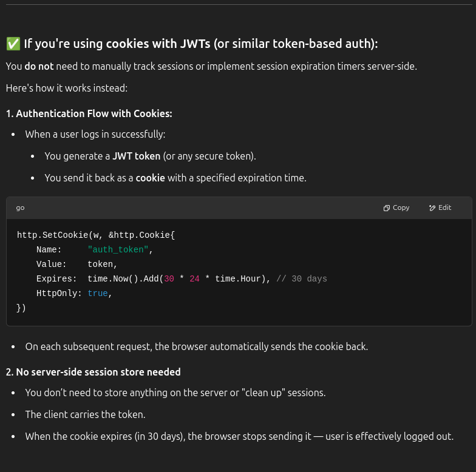
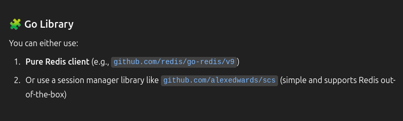

## Authentication

### 1. SIGNUP (done)
 **Route**: ```/api/signup```\
**METHOD**: ```POST```\
**Description**: Used for signup. Basic format checking must be done on client side.\
**Request body**:
```json
{
  "username": "string",
  "name": "string",
  "email": "string",
  "password": "string"
}
```
**Response**:
```json
{  
  "status": "bool",         // like: true: Success, false: Failure
  "message": "string"       // like: "User created successfully", "Username already used"
}
```
### 2. LOGIN  (done)
**Route**: ```/api/login```\
**METHOD**: ```POST```\
**Description**: Used for login. Basic format checking must be done on client side.\
**Request body**:
```json
{
  "username": "string",
  "password": "string"
}
```
**Response**:
```json
{  
  "status": "bool",         // like: true: Success, false: Failure
  "message": "string"       // like: "User logged in successfully", "Invalid username or password"
  // Set the cookie
	"http.SetCookie(w, &http.Cookie{
		Name:     "auth_token",
		Value:    token,
		Expires:  time.Now().Add(30 * 24 * time.Hour), // optional
		HttpOnly: true,
		Path:     "/",
        UserPreferences: "string" // like: "dark mode", "light mode"
	}"
}
```




We can use this to store the session values in the cookie (backend).



### 3. LOGOUT  (done)
**Route**: ```/api/logout```\
**METHOD**: ```POST```\
**Description**: Used for logout.\
**Request body**:
```json
{
  "username": "string"
  // cookie
    "http.SetCookie(w, &http.Cookie{
        Name:     "auth_token",
        Value:    token,
        Expires:  time.Now().Add(-1 * time.Hour), // optional
        HttpOnly: true,
        Path:     "/",
        UserPreferences: "string" // like: "dark mode", "light mode"
    }"
}
```
**Response**:
```json
{  
  "status": "bool",         // like: true: Success, false: Failure. status can only be true
}
```

### 4. FORGOT PASSWORD
**Route**: ```/api/forgot_password```\
**METHOD**: ```POST```\
**Description**: Used for forgot password. Basic format checking must be done on client side.\
**Request body**:
```json
{
  "username": "string",
  "email": "string"
}
```
**Response**:
```json
{  
  "status": "bool",         // like: true: Success, false: Failure
  "message": "string"       // like: "Password reset link sent to email", "Invalid username or email"
}
```

## Home Page

### 5. RESET PASSWORD   (done)
**Route**: ```/api/reset_password```\
**METHOD**: ```POST```\
**Description**: Used for reset password. Basic format checking must be done on client side.\
**Request body**:
```json
{
  "username": "string",
  "old_password": "string",
  "new_password": "string",
  "cookie"
}
```
**Response**:
```json
{  
  "status": "bool",         // like: true: Success, false: Failure
  "message": "string"       // like: "Password reset successfully", "Incorrect old password" 
}
```

### 6. GET USER DETAILS   (done)
**Route**: ```/api/get_user_details```\
**METHOD**: ```GET```\
**Description**: Used for getting user details.\
**Request body**:
```json
{  
  "username": "string",
  "cookie"
}
```
**Response**:
```json
{  
  "status": "bool",         // like: true: Success, false: Failure
  "email": "string",
  "name": "string"
}
```

### 7. CREATE GROUP     (done)
**Route**: ```/api/create_group```\
**METHOD**: ```PUT```\
**Description**: Used for creating a group. Basic format checking must be done on client side.\
**Request body**:
```json
{  
  "username": "string",
  "group_name": "string",
  "group_description": "string",
  "group_type": "string", // like: "OTS", "Grey Group", "Normal Group"
  "cookie"
}
```
**Response**:
```json
{  
  "status": "bool",         // like: true: Success, false: Failure
  "message": "string"       // like: "Group created successfully"
}
```

### 8. CREATE PRIVATE SPLIT    (done)
**Route**: ```/api/create_private_split```\
**METHOD**: ```PUT```\
**Description**: Used for creating a private split. Basic format checking must be done on client side.\
**Request body**:
```json
{  
  "username": "string",
  "username_2": "string",
  "group_description": "string",
  "cookie"
}
```
**Response**:
```json
{  
  "status": "bool",         // like: true: Success, false: Failure
  "message": "string"       // like: "Private-Split created successfully", "User not found", "Cannot create private-split with yourself"
}
```

### 9. JOIN GROUP      (done)
**Route**: ```/api/join_group```\
**METHOD**: ```PUT```\
**Description**: Used for joining a group. Basic format checking must be done on client side.\
**Request body**:
```json
{  
  "username": "string",
  "invite_code": "string",
  "cookie"
}
**Response**:
```json
{  
  "status": "bool",         // like: true: Success, false: Failure
  "message": "string"       // like: "Group joined successfully", "Invalid invite code"
}
```

### 10. GET TRANSACTION HISTORY   (done)
**Route**: ```/api/get_transaction_history```\
**METHOD**: ```GET```\
**Description**: Used for getting transaction history.\
**Request body**:
```json
{  
  "username": "string",
  "cookie"
}
```
**Response**:
```json
{  
  "status": "bool",         // like: true: Success, false: Failure
  "transactions": [
    "transaction_id" : "string",
    "other_user"  : "string",
    "is_sender": "bool",    // true: if the other user is sender, false: if the other user is receiver
    "amount"  : "float"
  ]
}
```

### VIEW GROUP ANALYSIS
//TODO: 


## Groups Page

### 11. GET GROUPS        (done)
**Route**: ```/api/get_groups```\
**METHOD**: ```GET```\
**Description**: Used for getting groups.\
**Request body**:
```json
{  
  "username": "string",
  "cookie"
}
```
**Response**:
```json
{  
  "status": "bool",         // like: true: Success, false: Failure
  "groups": [
    "group_name" : "string",
    "members" : "int",
    "group_id": "string"
    ]
}
```

### 12. GET GROUP DETAILS   (done)    Note: the group id has not been sent in the request body
**Route**: ```/api/get_group_details```\
**METHOD**: ```GET```\
**Description**: Used for getting group details.\
**Request body**:
```json
{  
  "group_id": "string",
  "cookie"
}
```
**Response**:
```json
{  
  "status": "bool",         // like: true: Success, false: Failure
  "group_details": [
    "group_description" : "string",
    "group_type" : "string", // like: "OTS", "Grey Group", "Normal Group", "Private-Split",
    "invite_code" : "string"
  ]
}
```

### 13. GET MEMBERS OF A GROUP    (done)     Note: the group id has not been sent in the request body
**Route**: ```/api/get_members```\
**METHOD**: ```GET```\
**Description**: Used for getting members of a group.\
**Request body**:
```json
{  
  "group_id": "string",
  "cookie"
}
```
**Response**:
```json
{  
  "status": "bool",         // like: true: Success, false: Failure
  "members": [
    "username" : "string",
    "name" : "string",
  ]
}
```

//Note: If the user exiting is an admin, should we send the list of members in the group here?
### 14. EXIT GROUP
**Route**: ```/api/exit_group```\
**METHOD**: ```DELETE```\
**Description**: Used for exiting a group.\
**Request body**:
```json
{  
  "username": "string",
  "group_id": "string",
  "cookie"
}
```
**Response**:
```json
{ 
  "is_admin": "bool",      // like: true: Success, false: Failure
  "status": "bool",         // like: true: Success, false: Failure
  "message": "string"       // like: "Group exited successfully", "Cannot exit group! All balances not settled", "Group not found", "Admin!", "Transactions not completely settled" 
}
```

### 15. SELECT ANOTHER ADMIN
**Route**: ```/api/select_another_admin```\
**METHOD**: ```PUT```\
**Description**: Used for selecting another admin, when former admin wants to exit group.\
**Request body**:
```json
{  
  "group_id": "string",
  "new_admin": "string",
  "cookie"
}
```
**Response**:
```json
{  
  "status": "bool",         // like: true: Success, false: Failure
  "message": "string"       // like: "New admin selected successfully", "Group not found", "User not found"
}
```

### 16. DELETE GROUP
**Route**: ```/api/delete_group```\
**METHOD**: ```DELETE```\
**Description**: Used for deleting a group.\
**Request body**:
```json
{  
  "group_id": "string",
  "username": "string",
  "cookie"
}
```
**Response**:
```json
{  
  "status": "bool",         // like: true: Success, false: Failure
  "message": "string"       // like: "Group deleted successfully", "Group not found", "You are not admin", "All balances not settled", "Transactions not completely settled"
}
```

### 17. GET EXPENSES OF A GROUP
**Route**: ```/api/get_expenses```\
**METHOD**: ```GET```\
**Description**: Used for getting expenses of a group.\
**Request body**:
```json
{  
  "username": "string",
  "group_id": "string",
  "cookie"
}
```
**Response**:
```json
{  
  "status": "bool",         // like: true: Success, false: Failure
  "expenses": [
    "expense_id" : "string",
    "amount" : "float",
    "description" : "string", 
  ]
}
```
## Balances Page

### 18. SHOW BALANCES OF A GROUP
**Route**: ```/api/show_balances```\
**METHOD**: ```GET```\
**Description**: Used for showing balances.\
**Request body**:
```json
{  
  "username": "string",
  "group_id": "string",
  "cookie"
}
```
**Response**:
```json
{  
  "status": "bool",         // like: true: Success, false: Failure
  "balances": [
    "sender" : "string",
    "receiver" : "string",
    "amount" : "float",
    "balanceAction": "int" // like: 0: remind, 1: settle, 2: Not involved
  ]
}
```

### SETTLE BALANCE
**Route**: ```/api/settle_balance```\
**METHOD**: ```PUT```\
**Description**: Used for settling a balance.\
**Request body**:
```json
{  
  "receiver": "string",
  "group_id": "string",
  "cookie"
}
```
**Response**:
```json
{  
  "status": "bool",         // like: true: Success, false: Failure
  "message": "string"       // like: "Balance settled successfully", "Group not found"
}
```

### REMIND BALANCE
**Route**: ```/api/remind_balance```\
**METHOD**: ```PUT```\
**Description**: Used for reminding a balance.\
**Request body**:
```json
{  
  "sender": "string",
  "group_id": "string",
  "cookie"
}
```
**Response**:
```json
{  
  "status": "bool",         // like: true: Success, false: Failure
  "message": "string"       // like: "Balance reminded successfully", "Group not found"
}
```


## in_transit Page

### 19. GET IN TRANSIT TRANSACTIONS
**Route**: ```/api/get_in_transit_transactions```\
**METHOD**: ```GET```\
**Description**: Used for getting in_transit transactions.\ 
**Request body**:
```json
{  
  "username": "string",
  "cookie"
}
```
**Response**:
```json
{  
  "status": "bool",         // like: true: Success, false: Failure
  "transactions": [
    "transaction_id" : "string",
    "sender" : "string",
    "amount" : "float",
    "group_name" : "string"
  ]
}
```

### 20. IN TRANSIT ACCEPT
**Route**: ```/api/in_transit_accept```\
**METHOD**: ```PUT```\
**Description**: Used for accepting a in_transit transaction.\
**Request body**:
```json
{  
  "transaction_id": "string",
  "username": "string",
  "cookie"
}
```
**Response**:
```json
{  
  "status": "bool",         // like: true: Success, false: Failure
  "message": "string"       // like: "Transaction accepted successfully", "Transaction not found"
}
```

### 21. IN TRANSIT REJECT
**Route**: ```/api/in_transit_reject```\
**METHOD**: ```PUT```\
**Description**: Used for rejecting a in_transit transaction.\
**Request body**:
```json
{  
  "transaction_id": "string",
  "username": "string",
  "cookie"
}
```
**Response**:
```json
{  
  "status": "bool",         // like: true: Success, false: Failure
  "message": "string"       // like: "Transaction rejected successfully", "Transaction not found"
}
```

## Expenses

### 22. GET EXPENSE DETAILS
**Route**: ```/api/get_expense_details```\
**METHOD**: ```GET```\
**Description**: Used for getting expense details.\
**Request body**:
```json
{  
  "expense_id": "string",
  "cookie"
}
```
**Response**:
```json
{  
  "status": "bool",         // like: true: Success, false: Failure
  "description" : "string",
  "tag" : "string",
  "last_modified" : "string",
  "paid_by" : ["string" : "float"],
  "owed_by" : ["string" : "float"],
  "amount" : "float"
}
```


1. For sending emails, use ```SendGrid```.
2. the flutter front end will know that the app has been backgrounded for more than 10 mins. So, it will send a request kind of thing to the server. and the server will close the connection. and then if the user opens the app after keeping it in background for 11 mins, then will flutter again send a request to open the web socket connection


